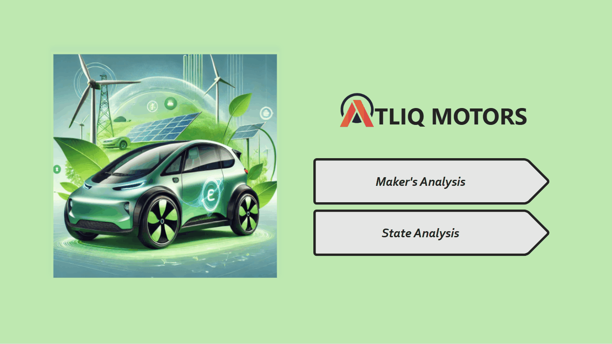

# END_USER_GUIDE.md — Power BI Report User Guide & Modeling Notes
## AtliQ Motors EV Insights Dashboard

---

## 1. Overview of the Report

The AtliQ Motors India EV Insights Dashboard is an interactive executive reporting application designed to explore automotive sales trends, EV penetration rates, and manufacturer market share across India.

### Report Structure:
1. **Home Page (Landing View):**
   - Brand landing page displaying AtliQ Motors identity, renewable energy hero visual, and direct navigation buttons (`Maker's Analysis >` and `State Analysis >`).
2. **Maker's Analysis Page:**
   - Focuses on manufacturer-level dynamics (P1, P4, P6).
   - Features KPI metric cards, Top/Bottom 3 2W Makers rankings, Top 5 4W Makers by CAGR, and a quarterly sales trend stream chart.
3. **State Analysis Page:**
   - Focuses on geographic adoption and state-level market expansion (P2, P3, P5, P7, P9).
   - Features state penetration rankings, EV vs. total sales combo chart (e.g. Delhi vs. Karnataka), Top 10 States total vehicle CAGR, and 2030 projected EV sales by vehicle category.

---

## 2. End-User Interaction Guide

### 2.1 Navigation
- Use the **Top Navigation Bar** on either analysis page to switch between `Home`, `Maker's Analysis`, and `State Analysis`. The currently active page is highlighted with a solid green pill button.

### 2.2 Persistent Left Filter Rail
Both analysis pages feature a dedicated green filter rail on the left with five interactive controls:
1. **Fiscal Year (`fiscal_year`):** Multi-select dropdown filtering by financial years (FY2022, FY2023, FY2024).
2. **Vehicle Category (`Vehicle_category`):** Multi-select dropdown filtering between `2-Wheelers` and `4-Wheelers`.
3. **Quarter (`quarter`):** Multi-select dropdown for financial quarters (`Q1`, `Q2`, `Q3`, `Q4`).
4. **Maker (`maker`):** Searchable multi-select dropdown. Type maker names (e.g., "Tata", "Ola") to filter the list live.
5. **State (`state`):** Searchable multi-select dropdown. Type state names (e.g., "Karnataka", "Delhi") to filter the list live. Selected items appear as removable chip tags.

### 2.3 Cross-Filtering & Visual Highlighting
- Clicking any bar or category in a chart dynamically slices all adjacent visuals on that page.
- To reset selections, click anywhere in the visual's blank background or clear the filter from the filter rail.

---

## 3. Assumptions, Modeling Inputs & Limitations

### 3.1 Financial Year Convention
- All reporting operates under the **Indian Fiscal Year calendar** (April 1 of the prior calendar year to March 31 of the stated year).
  - FY2022 = April 1, 2021 – March 31, 2022
  - FY2023 = April 1, 2022 – March 31, 2023
  - FY2024 = April 1, 2023 – March 31, 2024
- Year-over-year comparisons must never be confused with calendar years.

### 3.2 Revenue Pricing Modeling Assumptions (Rule R9)
- Source datasets supply **unit volumes only**, not transaction prices or invoice values.
- Revenue metrics are modeled based on published industry benchmark Average Selling Prices (ASP):
  - **2-Wheelers:** Assumed ASP of **₹1,00,000** (INR 1.0 Lakh).
  - **4-Wheelers:** Assumed ASP of **₹15,00,000** (INR 15.0 Lakhs).
- All revenue totals and growth rates must be interpreted as estimates reflecting volume growth multiplied by these constant category price levels.

### 3.3 2030 Projections Methodology (Rule R5)
- 2030 projections are computed by compounding each state's historical FY2022–FY2024 EV sales CAGR over 6 subsequent years ($\text{Sales}_{2030} = \text{Sales}_{2024} \times (1 + \text{CAGR})^6$).
- **Limitation:** This methodology assumes uninterrupted compounding growth without factoring in potential local grid saturation, lithium raw material supply constraints, or battery subsidy phase-outs.
